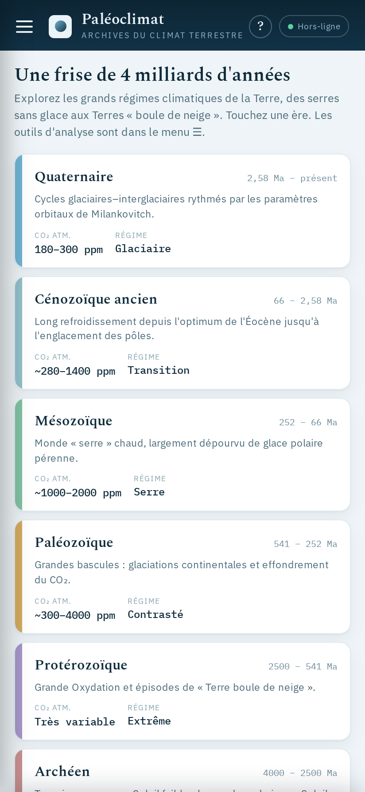
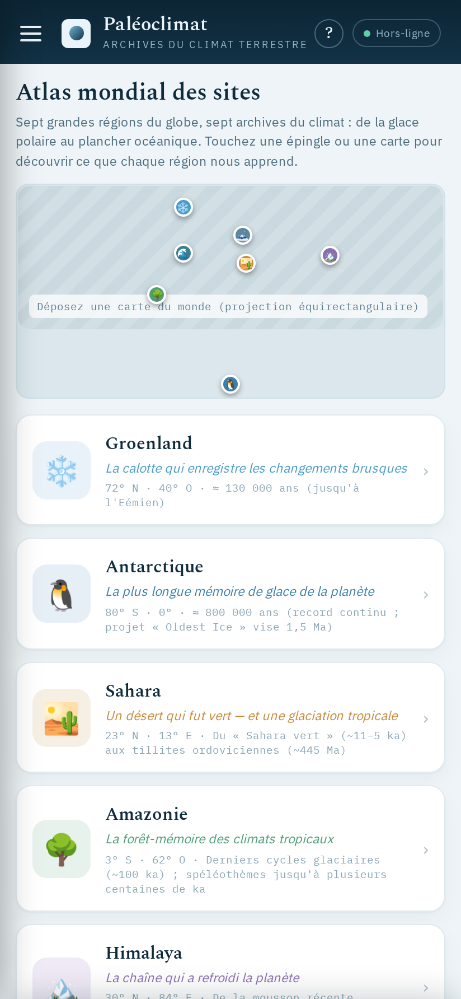
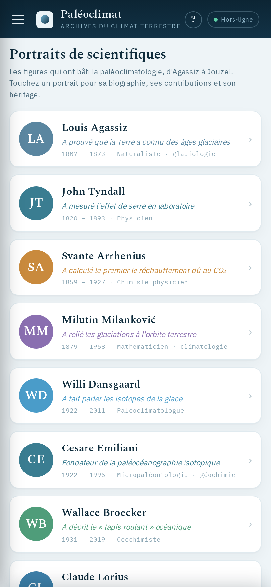
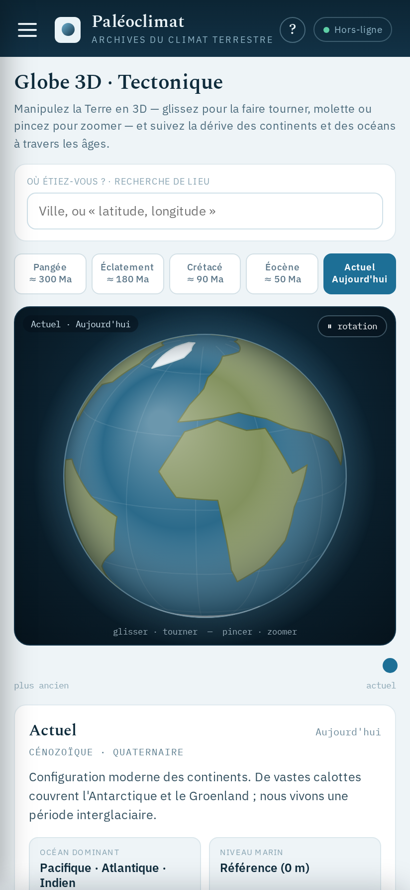
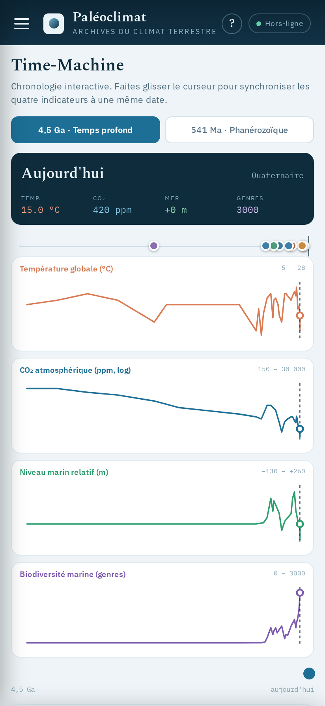
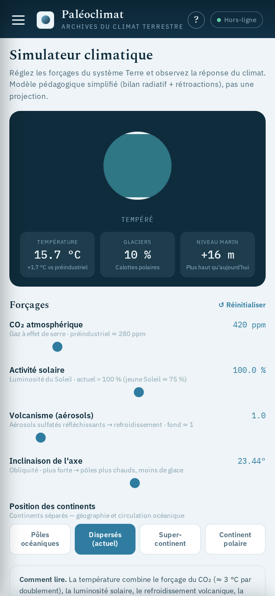

<div align="center">


# 🌍 Paléoclim

### Archives du climat terrestre — 4,5 milliards d'années dans votre poche

*Application mobile éducative (PWA, hors-ligne d'abord) pour explorer l'histoire du climat de la Terre : ères, glaciations, proxies, espèces indicatrices, grandes figures de la science… et des outils pour manipuler les données soi-même.*

<br />


</div>

---

## 📱 Aperçu

<div align="center">

| 🕰️ Frise des ères | 🌍 Atlas mondial | 👤 Portraits |
|:---:|:---:|:---:|
|  |  |  |
| **La Terre en 6 grandes ères** | **7 régions-archives du globe** | **D'Agassiz à Jouzel** |

| 🔵 Globe 3D | ⟳ Time-Machine | ⚙️ Simulateur |
|:---:|:---:|:---:|
|  |  |  |
| **Terre interactive `<canvas>`** | **4 courbes synchronisées** | **Réglez les forçages** |

</div>

---

## ✨ Fonctionnalités

### 🧭 Explorer
- 🕰️ **Frise des ères** — 4,5 Ga rangés en 6 grandes ères climatiques
- ⟳ **Time-Machine** — 4 courbes (CO₂, température, niveau marin, biodiversité) synchronisées sur un même axe
- 🌗 **Cartes paléo** — comparateur *Avant / Après* de la dérive des continents
- 🔵 **Globe 3D** — Terre interactive dessinée en `<canvas>`, projection orthographique maison
- ⌇ **Climat historique** — température, précipitations, pression de 1421 à 2008
- ⚜️ **Mode Histoire** — climat & sociétés : récoltes, famines, mortalité

### 🗂️ Bases de données
- 🌿 **Espèces indicatrices** · ☠️ **Espèces disparues** · ✦ **Galerie de fossiles**
- ▤ **Archives climatiques** (10 archives naturelles) · ⚡ **Événements extrêmes**

### 🗺️ Cartes & sites
- ⚑ **Carte des sites proxy** — où « voir » le paléoclimat, avec ajout de sites
- 🌍 **Atlas mondial** — Groenland, Antarctique, Sahara, Amazonie, Himalaya, Alpes, Océan Atlantique

### 👥 Portraits
- 👤 **Scientifiques** — biographies de Milanković, Agassiz, Emiliani, Broecker, Lorius, Jouzel, Tyndall, Arrhenius, Dansgaard, Shackleton

### 🔬 Outils d'analyse
- ⚙️ **Simulateur climatique** · ≣ **Superposition de données** · ∑ **Calculateur δ¹⁸O → T°** · ☉ **Bac à sable orbital (Milankovitch)**

### 📖 Comprendre
- ◈ **Galerie de proxies** · ≋ **Carottes de glace (EPICA · 800 ka)** · 🔤 **Glossaire du jargon**

---

## 🚀 Démarrer

```bash
cd app
npm install
npm run dev      # serveur de dev       → http://localhost:5173
npm run build    # build de production  → dist/  (PWA)
npm run preview  # prévisualiser le build
npm run lint     # oxlint
```

> 📸 **Régénérer les captures d'écran** (serveur dev lancé au préalable) :
> ```bash
> npm run shots
> ```

---

## 🧱 Architecture

Le prototype de design était déjà un composant React (état + `renderVals()`). Le port **conserve sa logique et son état comme spécification**, dans une architecture propre :

| 📄 Fichier | Rôle |
|---|---|
| `app/src/App.jsx` | Composant principal. État, **toutes les données scientifiques embarquées** (ères, espèces, archives, glaciations, atlas, scientifiques, séries EPICA/LR04…), les méthodes (globe canvas, insolation de Milankovitch, interpolations) et `renderVals()`. |
| `app/src/render.jsx` | `renderApp(v, self)` : le markup des **24 vues** en JSX, alimenté par `renderVals()`. |
| `app/src/css.js` | Helper `css()` : convertit les styles inline en objets React (mémoïsé). |
| `app/src/ImageSlot.jsx` | Emplacement d'illustration (placeholder rayé + dépôt d'image local). |
| `design_handoff_paleoclim/` | Prototype de design d'origine (`Paleoclim.dc.html`). |

- **🧭 Navigation** — appli mono-écran à tiroir (☰) : un state `screen` pilote ~24 vues ; les détails (ère, espèce, région, scientifique…) sont pilotés par des ids.
- **📦 Données** — **embarquées en dur**, aucune dépendance réseau à l'exécution. Un service worker (`vite-plugin-pwa`) précache l'app-shell.
- **🎨 Rendus programmatiques** — globe 3D (`<canvas>`), cartes à épingles, courbes SVG, tous dessinés à la main.

---

## 🗺️ Feuille de route

- [ ] **Polices** locales dans `public/fonts/` (Spectral, IBM Plex) pour un vrai hors-ligne
- [ ] **Illustrations** réelles à la place des placeholders rayés (paléoenvironnements, portraits)
- [ ] **Persistance** localStorage : sites ajoutés (`userSites`) + dernière vue
- [ ] **Icônes PWA** définitives dans `public/icons/`

---

<div align="center">

🧊 *Données et datations à visée pédagogique, issues de la littérature scientifique.*

Fait avec ❤️ et beaucoup de ☕ · React + Vite

</div>
